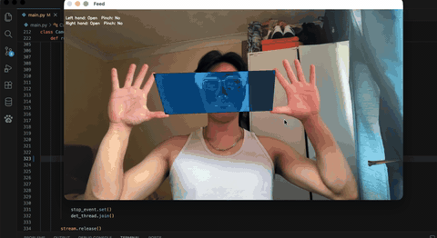

# Hand Projection

A real-time hand tracking application that detects both hands via webcam and applies visual effects to the region between them.

## Demo



## Features

- Real-time hand landmark detection using MediaPipe, running on a background thread for smooth rendering
- Detects and distinguishes left and right hands
- Connects the index finger tips and thumb tips of both hands with boundary lines to form the effect region
- Applies the active visual effect to the region between the hands:
  - **Risograph effect** — colour channel misregistration, grain, and warm pink/teal tint
  - **X-ray effect** — inverted, blue-tinted grayscale
  - **Gaussian blur effect** — heavy blur of everything inside the region
- **Pinch gesture to switch filters** — pinch thumb and index finger on both hands at the same time to cycle to the next effect
- Per-hand status overlay showing whether each hand is open or closed, and whether it is pinching

## Requirements

- Python 3.10+
- Webcam

## Installation

```bash
pip install opencv-python mediapipe numpy
```

## Setup

Download the MediaPipe hand landmark model and place it in the project directory:

```bash
curl -o hand_landmarker.task \
  "https://storage.googleapis.com/mediapipe-models/hand_landmarker/hand_landmarker/float16/latest/hand_landmarker.task"
```

## Usage

```bash
python3 main.py
```

- Hold both hands in front of the webcam
- The quadrilateral between your index finger tips and thumb tips shows the active effect (risograph by default)
- Pinch both hands simultaneously (thumb tip to index tip) to cycle through the effects: risograph → x-ray → gaussian blur
- Press `Esc` to quit

## How It Works

MediaPipe detects 21 landmarks per hand. The app uses landmark indices to find specific fingertip positions:

| Landmark | Finger |
|----------|--------|
| 4 | Thumb tip |
| 8 | Index finger tip |

The four corner points (both index tips and both thumb tips) form a quadrilateral mask. Effects are applied only within that mask and processed on the bounding box of the region (not the full frame) to keep performance high.

Hand detection runs on a separate thread: the main loop hands off each frame and renders using the most recent detection result, so the video feed stays responsive even when detection is slower than the camera.

A pinch is detected when the thumb tip and index tip are close together relative to the hand's size. When both hands transition into a pinch on the same frame, the active filter advances to the next one in the cycle.
